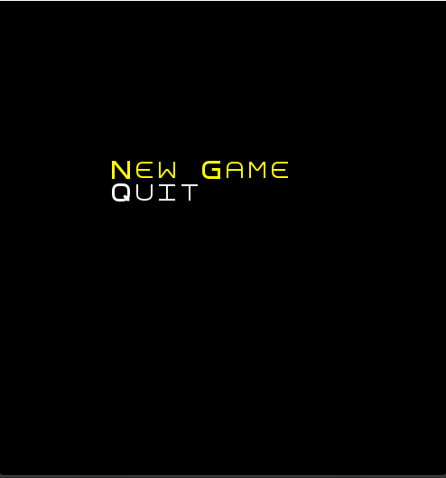
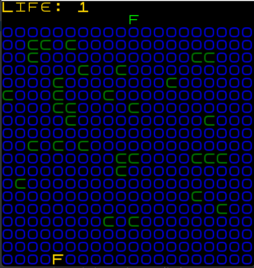

# LDTS_T08 - Frog

## Game Description

frog is an arcade-style game, whose main objective is to cross the river that has a strong flow to the left (which leads to a lethal waterfall). In addition, the frog must dodge obstacles that can also kill. 
After crossing the entire river, the frog can finally save his little baby frog.

This project was developed by Antonio Augusto Brito de Sousa (up202000705@fe.up.pt),  LDTS 2022-23.

For a more detailed version of this description click [here](./docs/README.md).

## Screenshots

The following screenshots ilustrate the general look of our game, as well as the divergent functionalities:
### Menus

  

  <b><i>IMG. Main menu from  game</i></b>

 
 

### Game

  

  <b><i>Fig 1. Gameplay </i></b>

  

