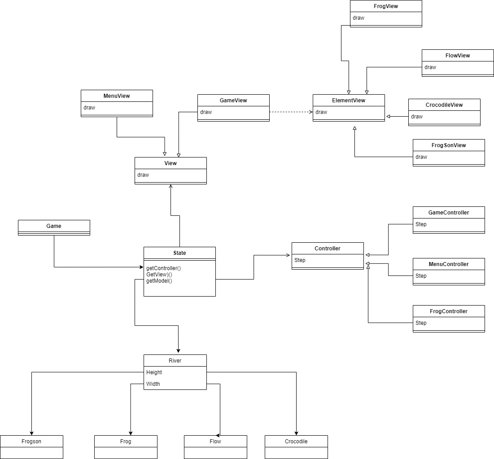
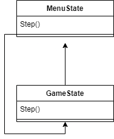
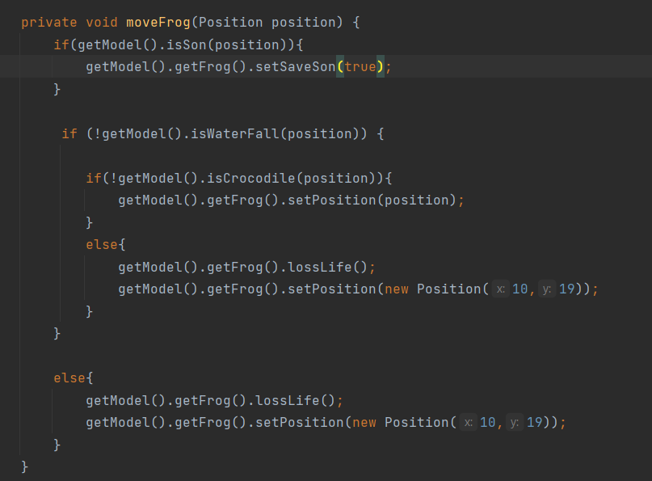
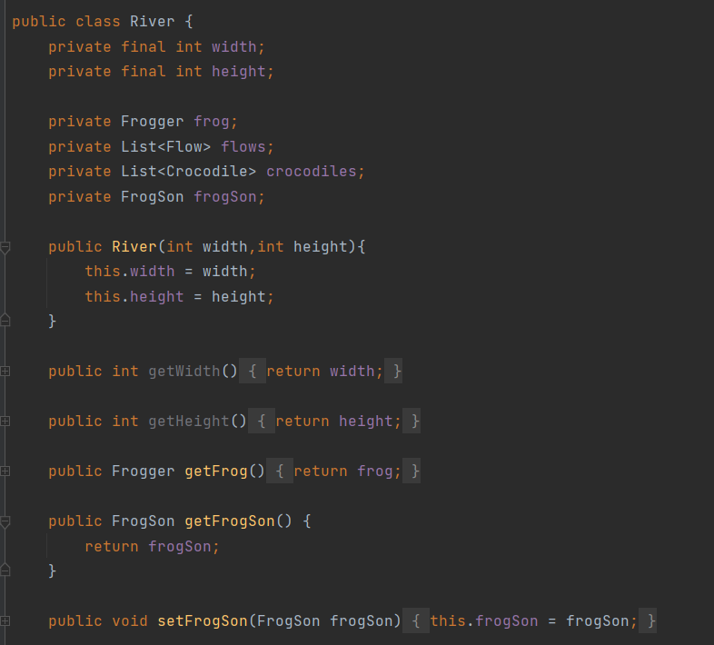

# LDTS2208

## LDTS_<T><G> - <Frogger>

**Example**:

In this game, a frog tries to cross a river to save its children on the other side.The problem is the water is getting faster and faster. and there are crocodiles (which might eat the frog). Therefore, the frog has a great challenge. But every time a frog saves the child across the river. Another son appears on the side of another river

This project was developed by *Antonio Augusto Brito de Sousa* (*up202000705*@fe.up.pt)  for LDTS 2022⁄23.

### IMPLEMENTED FEATURES or CANCELED FEATURES
- This section show the **Canceled Features** because the short time compatible to work and **Implemented Features**.
#### Canceled Features
 - **Ranking board** - the game has a ranking board with the best scores of another player.
 - **speed increment** - When the frog reach the other side of the river, the water speed is incremented, what is more difficult for the frog.
 - **Getting extra lifes** - Sometimes there are medicines on top of tree trunks.
 
#### Implemented Features
- **Move** - the up key moves forward and the down key backwards, as well as left and right.
- **Waterfall** - When the frog touch the left side of the screen, he falls into the waterfall and loses a life.
- **Murderers Crocodile** - When the frog touch a Crocodile, he loss a life.
- **Water Flow** - The water has a flow pushing to the left side of screen(Waterfall's direction), so, if the frog dont move to the right direction, he could be dead in a little bit of seconds.
 
- **Touch the little Frog to win** - When the big Frog touch the little one, the game's finish and then the main menu appear.
 
 ### DESIGN
 
 ### General Structure
 
 #### Problem in Context:
   The main concern of the project was how to automate and synchronize all game elements (frog, water and game commands) without a lot of **While loop** depending of states in very deep classes. Two main patterns were applied to the project, the **Model-View-Control Pattern_**, which is commonly used in a GUI and the **_State Pattern_**

#### Model-View-Control:
 The ease of using MVC lies in the separation of Model(data), Control(logic) and view(gui side).

#### Implementation:
 For the implementation they were focused on 4 main elements: Game, Menu, River and Frogger. That they are the only ones to have the complete MVC, and the Game inherits the characteristic of the River in the Controller. For the Model, all elements of the game that could store values were used. A Model named Objecto is created, which generates an inheritance for all other models outside the fantastic quartet above. Finally, all models have a View that is responsible for designing the model, in addition to making a direct connection with Lanterna's Package through the package gui.
 
 

#### The State pattern saved my code for **While loop**

**Problem in Context**

The old code had lots and lots of whiles, which depended on model states. The problem was that these layers became deep. For this, the State pattern was used.

**The Pattern**

The essence of the code has 32 states: Menu and Game. The state is responsible for saving and connecting the mvc model of the different objects, which guarantees interconnection and execution through the Step method. Furthermore, the SetState method ensures the ease of moving from one state to another in the parent class "Game"

**Implementation**

The following figure shows how the pattern’s roles were mapped to the application classes.

#### KNOWN CODE SMELLS AND REFACTORING SUGGESTIONS

#### DUPLICATE CODE
-- In this case, we have repetition of else and ifs, a solution would be to create a separate function with the same logic

#### LARGE CLASS
-- In this situation, the River River construct model performs several actions that could be linked to other models, which makes a long class. A solution would be to put in the specific class of each method

#### Primitive Obsession
-- In this situation constant values could be passed or via get from another class

### TESTING

There is no acessible tests.

### SELF-EVALUATION

Since it was a job for a group of 1 person, I believe I did my best to take university and work full time simultaneously. However, I confess that there are points that I could have tried a little harder, like the creation of some tests and other states like GameOverState. But in the end, what was worth was the learning.

 

